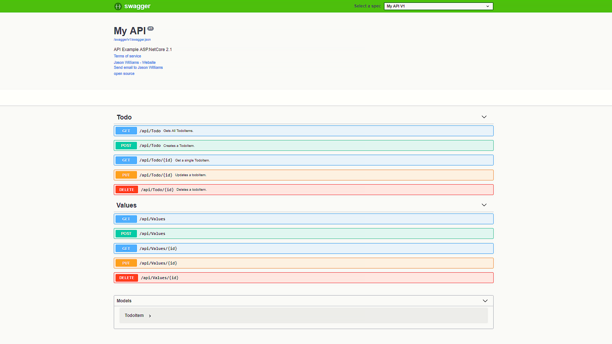
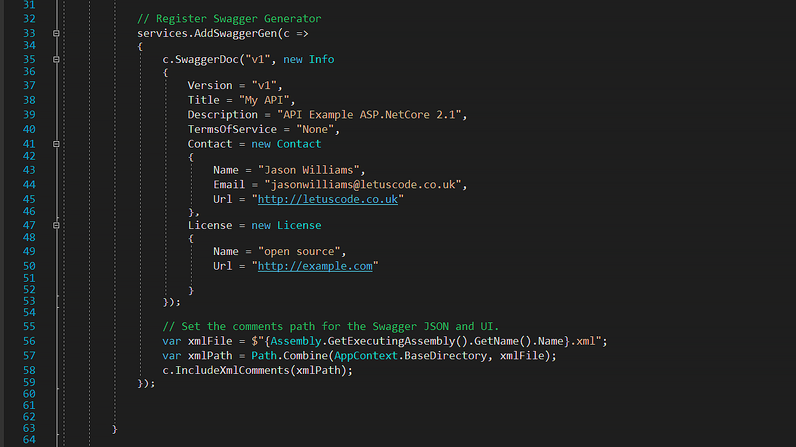
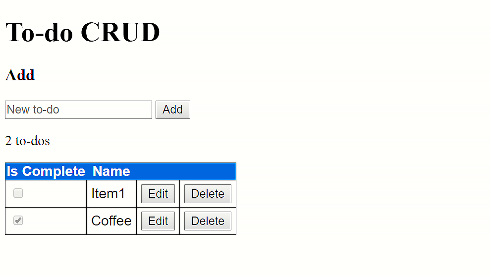
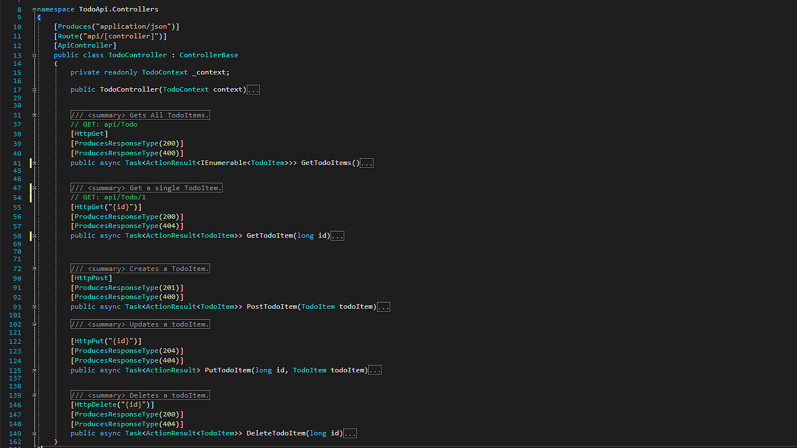

# ASP.net-core-swagger
Asp.net core 2.1 api example with swagger integration.

# ASP.Net Core API Example with Swagger

```
> git clone


```

## API Documentation

<div align="center">

</div>

## Swagger setup

<div align="center">

</div>


## UI Example

<div align="center">

</div>

## Controllers Example

<div align="center">

</div>


